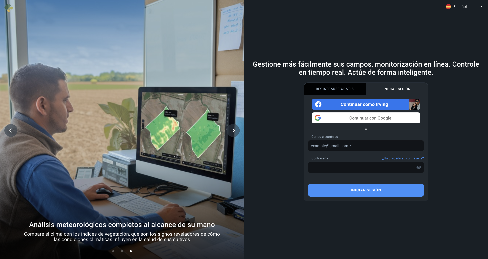

# manual_usuario.md
# Super Manual de Usuario: EOSDA Crop Monitoring

Este documento es la referencia definitiva para el uso experto de la plataforma **EOSDA Crop Monitoring**. Dividido en secciones modulares, cubre desde los fundamentos físicos de la teledetección hasta la exportación de datos para maquinaria de precisión.

---

## Tabla de Contenidos Extendida

### Bloque A: Fundamentos e Interfaz
1. [Introducción a la Teledetección Agrícola](#1-introducción-a-la-teledetección-agrícola)
2. [Procedimientos de Acceso (Login y Logout)](#2-procedimientos-de-acceso-login-y-logout)
3. [Recorrido 360° por la Interfaz (UI)](#3-recorrido-360-por-la-interfaz-ui)
4. [Configuración de Perfil y Notificaciones Críticas](#4-configuración-de-perfil-y-notificaciones-críticas)

### Bloque B: Gestión Operativa de Campos
4. [Añadir Campos: Métodos y Especificaciones de Archivo](#4-añadir-campos-métodos-y-especificaciones-de-archivo)
5. [Organización Superior: Grupos y Etiquetas](#5-organización-superior-grupos-y-etiquetas)
6. [Field Leaderboard: Priorización de Tareas](#6-field-leaderboard-priorización-de-tareas)

*Visualización rápida de los bloques temáticos.*

### Bloque C: Analítica de Vegetación y Clima
7. [Diccionario Maestro de Índices (NDVI, NDRE, MSAVI, etc.)](#7-diccionario-maestro-de-índices)
8. [Uso del Split View y Comparación de Fechas](#8-uso-del-split-view-y-comparación-de-fechas)
9. [Análisis de Humedad del Suelo y Estrés Hídrico](#9-análisis-de-humedad-del-suelo-y-estrés-hídrico)
10. [Monitoreo Climático y Acumulados de Calor (GDD)](#10-monitoreo-climático-y-acumulados-de-calor-gdd)

### Bloque D: Agricultura de Precisión y Campo
11. [Mastering Seasonality: Gestión de Campañas](#11-mastering-seasonality-gestión-de-campañas)
12. [Módulo de Scouting: De la Pantalla al Surco](#12-módulo-de-scouting-de-la-pantalla-al-surco)
13. [Mapas VRA: Aplicación Variable de Insumos](#13-mapas-vra-aplicación-variable-de-insumos)
14. [Data Manager: Integración de Maquinaria](#14-data-manager-integración-de-maquinaria)

### Bloque E: Casos de Uso y Soluciones
15. [Escenario: Gestión de Maíz](#15-escenario-gestión-de-maíz)
16. [Escenario: Gestión de Trigo](#16-escenario-gestión-de-trigo)
17. [Gestión de Equipos y Jerarquías](#17-gestión-de-equipos-y-jerarquías)
18. [Glosario de Términos Profesionales](#18-glosario-de-términos-profesionales)
19. [Resolución de Problemas y Preguntas Frecuentes](#19-resolución-de-problemas-y-preguntas-frecuentes)

---

## 1. Introducción a la Teledetección Agrícola
EOSDA Crop Monitoring no solo muestra fotos; mide la **reflectancia espectral**. Las plantas saludables reflejan mucha energía en el Infrarrojo Cercano (NIR) y absorben luz roja. Esta diferencia es la base de todos los índices que verás en la plataforma.

---

## 2. Procedimientos de Acceso (Login y Logout)
El control de acceso es el primer paso para proteger la integridad de tus datos agrícolas.

### Inicio de Sesión (Login)
1. **Acceso al Portal**: Ingresa a [crop-monitoring.eos.com](https://crop-monitoring.eos.com/).
2. **Credenciales**: Introduce tu correo electrónico registrado y contraseña.
   - *Tip*: También puedes usar el inicio de sesión rápido mediante Google, Facebook o LinkedIn si vinculaste tu cuenta.
3. **Recuperación de Contraseña**: Si olvidaste tus datos, haz clic en *"¿Olvidó su contraseña?"*. Recibirás un enlace de restablecimiento en tu email institucional.
4. **Verificación**: En algunos casos, se puede requerir una verificación de dos pasos (2FA) para aumentar la seguridad.

### Cierre de Sesión (Logout)
Es fundamental cerrar la sesión al finalizar la jornada, especialmente en computadoras compartidas o tablets de campo.
1. **Ubicación**: Dirígete al icono de tu perfil en la esquina inferior de la barra lateral izquierda.
2. **Acción**: Haz clic en el nombre de tu usuario y selecciona la opción **"Cerrar Sesión"** o **"Log Out"**.
3. **Confirmación**: El sistema te redirigirá a la pantalla de inicio de sesión, confirmando que tu sesión ha expirado de forma segura.

*Descripción: Formulario de acceso y opciones de recuperación de cuenta.*

---

## 3. Recorrido 360° por la Interfaz (UI)

## 4. Añadir Campos: Métodos y Especificaciones de Archivo
Para un análisis preciso, el polígono debe excluir caminos y edificaciones.

- **Importación Profesional**:
  - **Sistemas de Coordenadas**: Se recomienda **EPSG:4326 (WGS84)**.
  - **Atributos de Archivo**: Los archivos `.shp` deben incluir los archivos secundarios `.dbf`, `.shx` y `.prj`.
  - **Encoding**: UTF-8 para evitar errores en nombres con acentos o caracteres especiales.

*Captura recomendada: Menú de importación con archivos .shp o .kml.*

---

## 6. Field Leaderboard: Priorización de Tareas
Esta herramienta es vital para empresas que manejan más de 50 campos.
- **Lógica**: Ordena tus parcelas basándose en la **variación de NDVI** entre las dos últimas capturas.
- **Acción**: Si un campo sube al primer lugar con una caída de -0.15, es tu máxima prioridad para el equipo de scouting.

*Captura recomendada: Tabla del Leaderboard mostrando variaciones de NDVI.*

---

## 7. Diccionario Maestro de Índices
| Índice | Banda Utilizada | Aplicación Específica |
| :--- | :--- | :--- |
| **NDVI** | Red + NIR | Vigor general. El estándar de la industria. |
| **NDRE** | Red-Edge + NIR | Más preciso en etapas de alta densidad foliar. |
| **ReCI** | Red-Edge + Chirp | Estimación directa del contenido de clorofila. |
| **MSAVI** | Red + NIR (Aj.) | Uso obligatorio en siembra y emergencia temprana. |
| **VMI** | Multispectral | Índice propietario para detección de anomalías sutiles. |

*Captura recomendada: El mismo campo visualizado con diferentes índices (NDVI vs NDRE).*

---

## 11. Mastering Seasonality: Gestión de Campañas
La plataforma permite separar los datos por "Temporadas". 
- **Configuración**: Define el inicio (pre-siembra) y el fin (pos-cosecha).
- **Importancia**: Esto limpia los gráficos de NDVI de los residuos del cultivo anterior, permitiendo un análisis puro de la campaña actual.

*Captura recomendada: Selector de fechas y cultivos en el panel de Seasonality.*

---

## 12. Módulo de Scouting: De la Pantalla al Surco
**Flujo de Trabajo Certificado**:
1. **Identificación**: En el mapa, selecciona el icono "Scouting".
2. **Asignación**: Haz clic en la zona roja de NDVI y escribe: *"Posible ataque de oruga al ras, verificar margen norte"*.
3. **App Móvil**: El scout llega al punto (el GPS lo guía). 
4. **Formulario**: El scout selecciona la plaga de una lista preconfigurada, añade el porcentaje de daño y adjunta 3 fotos.
5. **Cierre**: Los datos se sincronizan y el administrador recibe un PDF del reporte.

---

## 13. Mapas VRA: Aplicación Variable de Insumos
Este módulo es el puente a la maquinaria.
- **Algoritmo de Zonificación**: Utiliza clustering para agrupar píxeles con valores similares.
- **Configuración**: Puedes elegir entre **Zonificación por Vegetación** (actual) o **Productividad** (histórica).
- **Dosis**: Entra los valores de aplicación (ej. 150 kg/ha en zona alta, 100 kg/ha en zona media).
- **Exportación**: Genera el archivo para John Deere, Trimble o Raven.

*Captura recomendada: Mapa de zonas de aplicación con diferentes dosis por color.*

---

## 15. Escenario: Gestión de Maíz
- **V-4 a V-6**: Usa **MSAVI** para monitorear el establecimiento.
- **Floración**: Usa **NDRE** para evitar la saturación del NDVI y ver el estado real de los estigmas.
- **Llenado**: Monitorea el **NDMI** para gestionar el riego crítico en esta etapa.

---

## 18. Glosario de Términos Profesionales
- **NIR (Near Infrared)**: Energía reflejada por la estructura celular interna de las hojas.
- **Pixel**: La unidad mínima de medida (10x10 metros en Sentinel-2).
- **Nadir**: Punto de captura directamente debajo del satélite.
- **Teledetección**: Ciencia de obtener información sin contacto físico.

---

## 19. Resolución de Problemas (Troubleshooting)
- **Problema**: "Mi campo se ve blanco o nublado".
  - **Solución**: Revisa el filtro de nubosidad. Si es >90%, la imagen no es útil. Busca la captura anterior.
- **Problema**: "El NDVI es muy bajo pero el cultivo se ve bien".
  - **Solución**: Verifica si es un cultivo de hoja pequeña o si hay mucha sombra por la hora de captura.

*Captura recomendada: Imagen satelital con interferencia de nubes.*

---

© 2026 Guía Maestra elaborada por Irving Morales. 
